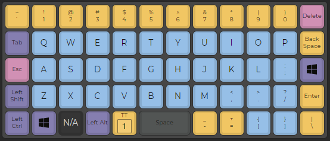
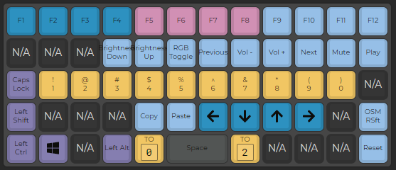
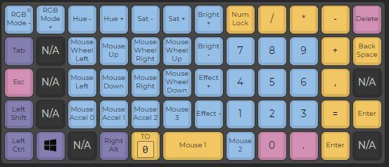

# QMK-Keyboards

## My Setups
### Preonic rev3 MassDrop X OLKB
Layer 0

Layer 1

Layer 2

Hardware:
*  Drop X OLKB Preonic 
* Kaihua hotswap sockets
* Gateron Aliaz Silent Switches (80g)
* YMDK ZDA Matcha Keycaps

## Resources
* [QMK Configurator](https://config.qmk.fm/) - For graphically editing QMK profiles
* [Keyboard Tester](https://config.qmk.fm/#/test) - For finding dead switches and such
* [QMK Keycodes Reference](https://docs.qmk.fm/#/keycodes) - For quick reference
* [QMK Documentation](https://docs.qmk.fm/#/) - For any and all questions
